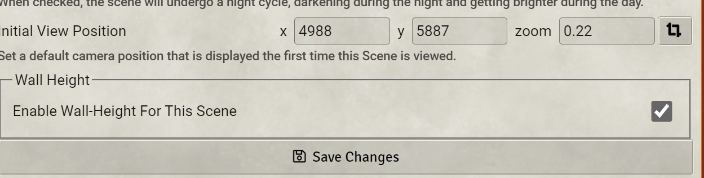

# Wall Height

## Before opening an issue read [THIS](https://github.com/theripper93/Levels/blob/v9/ISSUES.md)
Give a vertical dimension to your walls.

 [](https://forge-vtt.com/bazaar#package=wall-height)  [](https://www.patreon.com/theripper93) [](https://discord.gg/F53gBjR97G)

Thank you to Cole Schultz (cole#9640) for the original implementation and Erithtotl (Erithtotl#5139) for maintaining the module. I (theripper93) have now taken over the Module. Big thanks to dev7355608 (EBER#7243) For the help on the 4.0 update!

## IMPORTANT Wall Height 4.0+ Data Migration

Due to misconfigured data stracture from the old implementation, i've rewritten a good portion of the module and fixed said data structure, this requires a data migration - during the first launch of Wall Height version 4.0+ the module will auto migrate the data on all your scenes and compendiums (this includes token attacher data). If you need to migrate the data again (for example if you import premium content from creators that was not migrated) you can always do the migration again by enabling the setting in the module settings and refreshing (f5).

Macros are also included to run migrations if needed.

**Due to the massive multi module update, if something does not work as expected after migration please restart your server and ctrl+f5 the page to ensure the browser cache is reloaded**

### How To Migrate content creator maps and prefabs

If you aquire content made with the old data structure here is how to manually migrate scenes\compendiums and Token Attacher Prefabs:

1) Enable the modules that you wish to migrate ( EG. Baileywiki Maps Towns )
2) Unlock ALL the actor compendiums containing Token Attacher Prefabs
3) In the Wall Height Macro compendium `Wall Height Macros` run the `Wall Height - Migrate Everything` Macro and wait for it to finish
4) In the Token Attacher Macro compendium `Example Macros` run `(TA) Migrate Actors for Wall Height` and `(TA) Migrate Compendiums for Wall Height` Macros waiting for each one to finish.
5) Done, you are now migrated to the new data structure - You can repeat this process how many times you want.

*Note: you can check the progress of the Token Attacher macros in the console (F12)

## Breaking 4.0 Change

The Top of walls is now included in vision blocking calculations (for example a 0-5 wall will block vision of a 5 elevation token) This means that if you had maps that relied on Exact numbers you might notice some walls are now blocking sight - if you need you can reduce by 1 the TOP of all the walls to have vision blocking work as before - this can be done though a macro present in the `Wall Height Macros` compendium called `Wall Height - Reduce Top By  One`

---

This Module adds the ability to give a vertical height to walls, this means that tokens can look and move under\over them depending on their elevation. To further enhance the threedimensionality of your experience the use of [Levels](https://github.com/theripper93/Levels) is suggested as well!



The top and bottom heights of the walls are configurable in the wall configuration dialog.


## New Lighting/Sound Restriction

Since 4.0+ Wall Height has the ability to calculate light and sound polygons indipendently of the selected token by enabling the "Constrained by Elevation" option. This option is Globally Enabled by default - you can turn it off in the module settings.


For this option to work you need to assign an elevation value (top\bottom) to the light\sound - these values are shared with Levels. For a source to be constrained by a wall it's whole range must be included in the wall (eg. 0/9 light will be constrained by 0/9 wall but not by a 0/8 wall)

---

Finally, 3.5 adds a Macro Compendium, with a Set Elevation macro, which allows for quick updating of the elevation of multiple tokens, handy when the party is moving to different levels on a multilevel map.

With 3.5.2, the Set Elevation macro has been modified to support Multilevel Tokens (https://foundryvtt.com/packages/multilevel-tokens/) (can accept one or two parameters for entry and exit elevations).

libWrapper is now a required dependency.

## Elevation Helpers

To avoid data duplication, Wall Height uses a data path belonging to the Levels module to store it's elevation - If Levels is not enabled you can use these helpers to read and set the elevation of a sound or light document

```js
WallHeight.setSourceElevationTop(document, value)
WallHeight.getSourceElevationTop(document)

WallHeight.setSourceElevationBottom(document, value)
WallHeight.getSourceElevationBottom(document)
```

Or, if you want to set\get both at the same time

```js
WallHeight.setSourceElevationBounds(document, bottom, top)
WallHeight.getSourceElevationBounds(document)
```

## Project Status

As I'm now mantaining the module, Wall Height will keep preserving it's orginal porpouse of setting an elevation to walls, to keep this module as conflict free as possible no other functionalies for three dimensional navigation will be added since those will be kept for implementation in Levels while this module will serve as a light weight variant for veerticality for users that don't need the full suit of features.

## Compatibility

This module is likely incompatible with modules which modify token vision.

## License

Licensed under the GPLv3 License (see [LICENSE](LICENSE)).
